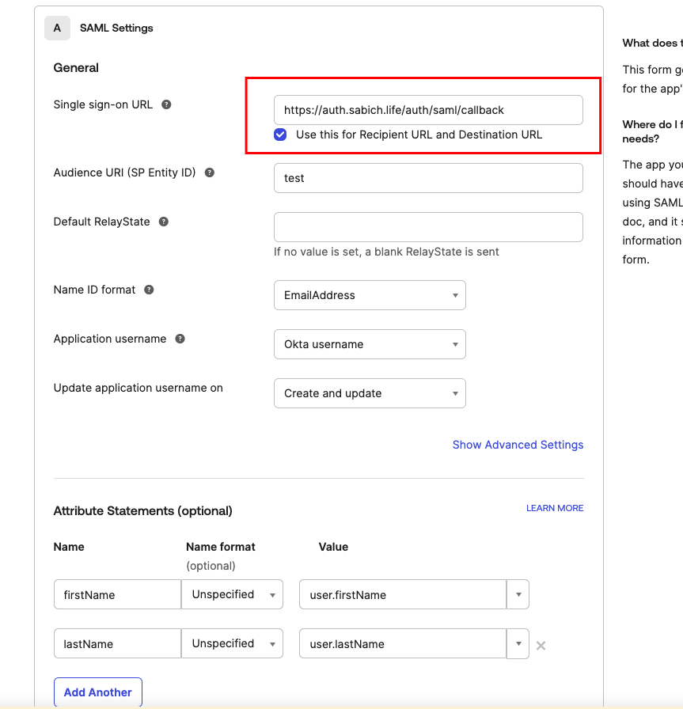
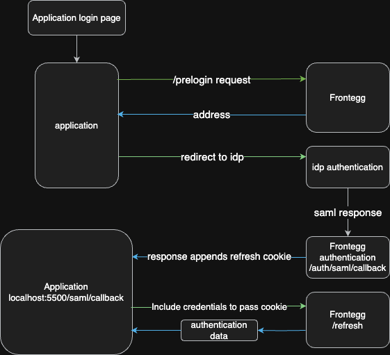

# SSO with Frontegg APIs

This is a sample application to showcase how to implement a login with sso flow using Frontegg APIs
Currently supports only SAML login

Refer to [this guide](https://support.frontegg.com/frontegg/article/ART-3940-how-to-implement-single-sign-on-sso-flow-with-frontegg-apis) for initial setup

## Basic steps to set up

### Set up IdP configurations - Okta exapmple

1. set your acs url as configured on Frontegg
   ```bash
   "https://[your-frontegg-domain/custom-domain]/auth/saml/callback"
   ```
   
2. Set up configuration as normal based on [this doc](https://developers.frontegg.com/guides/authentication/sso/management/saml)

### Set up SAML Redirect URL

The SAML redirect URL is where the user will be redirected to after being authenticated both on the IdP and on Frontegg.
The redirect will also include a refresh cookie, that should be used to get a user token on the client side.
In this example, we redirect to http://localhost:5500/saml/callback, which has a component that calls the refresh endpoint and gets the user into an authenticated state.


## Flow implementation in the app



1. The user enters their name into a form that calls a prelogin request and gets back a redirect url to idp login (handled by the Frontegg login box in the usual flow)

2. redirect a user to the idp on login (Is implemented on getPrelogin on loginWithCustomSSO.tsx, and is also handled by the SDK in the usual flow)

3. after login the idp will send a request to the acs url you've set with the below payload:

```bash
  { "RelayState": string (the state that Frontegg provided to the IDP in the request to the IDP), "SAMLResponse": string(the authenticated entity data) }
```

4. The ACS URL ([domain]/auth/saml/callback) handles Frontegg authentication - it generates a refresh cookie and redirects to the redirect URL set on the Set up SAML Redirect URL section. (for this example it's localhost:5500/saml/callback)

5. In the client side, send a POST https://[your-frontegg-domain]/identity/resources/auth/v2/user/token/refresh and include the refresh cookie to get the user authentication data, the interface for that can be found under /types/auth.types.ts

6. Store the data recieved in your state

## Installation

1. Clone the repo
2. add .env files to each of the folders

_client_

```bash
 VITE_FE_BASE_URL=https://[YOUR_FRONTEGGG_DOMAIN].frontegg.com
```

3. install dependencies

```bash
npm i
```

4. Run both the client and the server. The client should be running on localhost:5500 and the server on localhost:3001

```bash
  npm run dev // inside both folders
```
